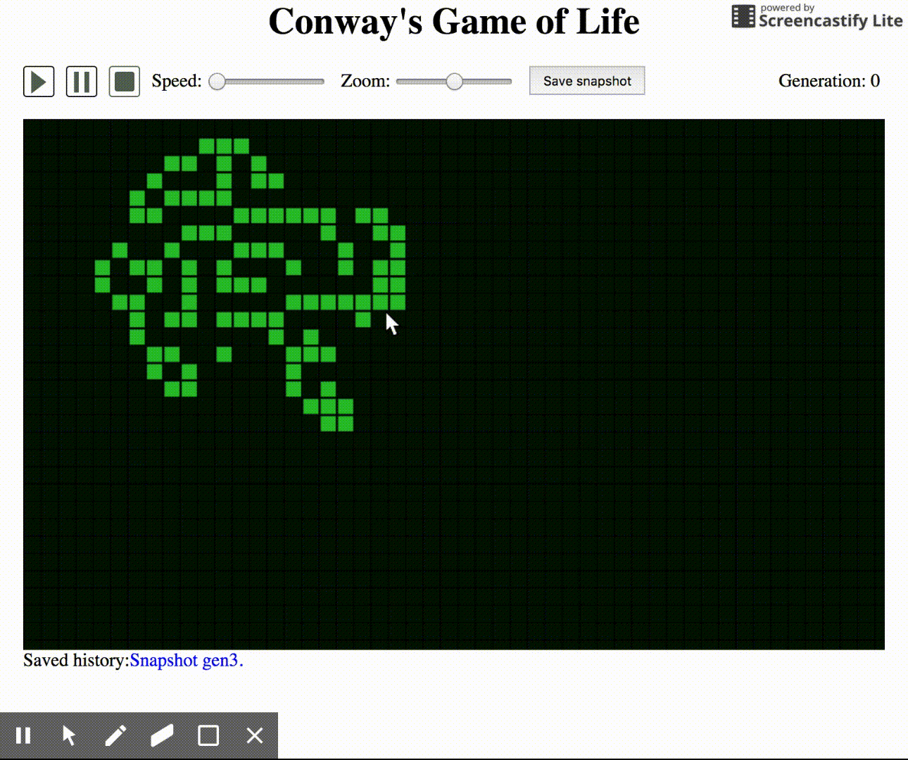

```javascript
const selector = document.getElementsByClassName('gameOfLife')[0]
new GameOfLife(selector)
```

## Додаткові параметри
Модуль має додаткові налаштування, які передаються 2 параметром:
```javascript
const options = {
	gameSize: 200,
	itemWidth: 13,
	state: [
		[0, 0, 0],
		[1, 1, 1],
		[0, 0, 0],
	]
}

new GameOfLife(selector, options)
```

**gameSize** - ширина і висота гри в клітинках
**itemWidth** - початковий розмір клітинки в px
**state** - гру можна почати з вже існуючими вибраними клітинками. Потрібно передати двохмірний массив
зі значеннями: 1- вибрана клітинка, 0 - пуста клітинка.
Дані зберігаються саме такому вигляді, так дуже просто з ними працювати.
